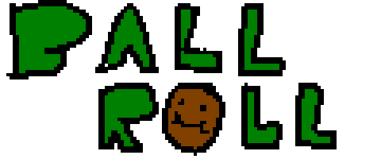

# Ball Roll - The Game

Ball Roll is a endless runner game, when you encounter alot of enemy that a square, you are a ball and your mission is dodge all of them, get your heal ball and use blue orb to counter attack the big square

## Play Game
- Play the game on stable version on [Itch.io Link](https://huy1234th.itch.io/ball-roll-the-game)
- Or play the nightly version on [Github Link](https://khuonghoanghuy.github.io/Ball-Roll/)

## Download the nightly build
- [Download for Windows](https://nightly.link/khuonghoanghuy/Ball-Roll/workflows/main/master/windowsBuild.zip)
- [Download for MacOS](https://nightly.link/khuonghoanghuy/Ball-Roll/workflows/main/master/macosBuild.zip)
- [Download for Linux (Ubuntu)](https://nightly.link/khuonghoanghuy/Ball-Roll/workflows/main/master/linuxBuild.zip)

## Credits
Go to this [file](./CREDITS.md)